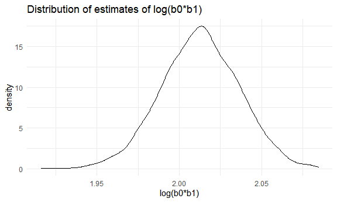
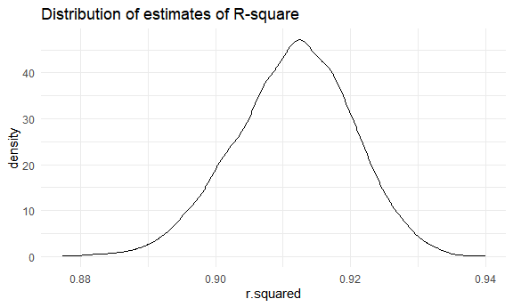

HW6
================
Mengfan Luo
12/3/2021

## Problem 1

### Data loading and cleaning

Data is loaded and cleaned. There’s no missing data in the dataset.
`babysex`, `frace`, `malform`, and `mrace` are converted to factors.

``` r
birthweight_df = read_csv("data/birthweight.csv")
```

    ## Rows: 4342 Columns: 20

    ## -- Column specification --------------------------------------------------------
    ## Delimiter: ","
    ## dbl (20): babysex, bhead, blength, bwt, delwt, fincome, frace, gaweeks, malf...

    ## 
    ## i Use `spec()` to retrieve the full column specification for this data.
    ## i Specify the column types or set `show_col_types = FALSE` to quiet this message.

``` r
sum(is.na(birthweight_df))
```

    ## [1] 0

``` r
birthweight_df = birthweight_df %>% mutate(
  babysex = factor(babysex, labels = c("male","female" )),
  frace = factor(frace, labels = c("White", "Black", "Asian", "Puerto Rican", "Other")),
  malform = factor(malform, labels = c("absent", "present")),
  mrace = factor(mrace, labels = c("White", "Black", "Asian", "Puerto Rican"))
  
) %>% 
  relocate(bwt)
```

### Variable selection and model contruction

Since all values in `pnumlbw` and `pnumsga` are 0, these variables are
helpless in predicting baby’s birth weight, thus is removed. Similar to
`parity`, which only 3 samples have values other than 0.

Using `corrplot`, we can see the correlation between numeric variables.
The outcome of interest `bwt` has a relatively strong correlation with
`bhead`, `blength`, `gaweeks`, and `delwt`, so we want to include these
variables in our model. We can also see that these variables are not
correlated with each other, so we don’t need to consider problem of
colinearity. Also, looking at the categorical variables, female and male
baby may have difference in birth weight, so we also include `babysex`.
Thus our model includes `bhead`, `blength`, `gaweeks`,`delwt` and
`babysex`

``` r
birthweight_df = birthweight_df %>% 
  select(-pnumlbw,-pnumsga,-parity)

birthweight_cor = birthweight_df %>% 
  select(-babysex, -frace, -malform, -mrace) 

corrplot(cor(birthweight_cor), type = "upper", diag = FALSE)
```


Model was fitted and we can see p values for all estimates of the
coeficients are &lt; 0.05. A plot of model residuals against fitted
values was shown.

``` r
fit = lm(bwt ~ bhead + blength+ gaweeks+ delwt+ babysex, data = birthweight_df)

summary(fit)
```

    ## 
    ## Call:
    ## lm(formula = bwt ~ bhead + blength + gaweeks + delwt + babysex, 
    ##     data = birthweight_df)
    ## 
    ## Residuals:
    ##      Min       1Q   Median       3Q      Max 
    ## -1172.25  -183.46   -11.24   175.57  2529.39 
    ## 
    ## Coefficients:
    ##                 Estimate Std. Error t value Pr(>|t|)    
    ## (Intercept)   -6314.4740    96.8895 -65.172  < 2e-16 ***
    ## bhead           137.7524     3.5374  38.942  < 2e-16 ***
    ## blength          79.2680     2.0713  38.270  < 2e-16 ***
    ## gaweeks          13.6758     1.4960   9.142  < 2e-16 ***
    ## delwt             2.0272     0.1992  10.175  < 2e-16 ***
    ## babysexfemale    31.8168     8.7382   3.641 0.000275 ***
    ## ---
    ## Signif. codes:  0 '***' 0.001 '**' 0.01 '*' 0.05 '.' 0.1 ' ' 1
    ## 
    ## Residual standard error: 282.4 on 4336 degrees of freedom
    ## Multiple R-squared:  0.6964, Adjusted R-squared:  0.696 
    ## F-statistic:  1989 on 5 and 4336 DF,  p-value: < 2.2e-16

``` r
fit %>% 
  broom::tidy() %>% 
  mutate(term = str_replace(term,"babysex","sex_")) %>% 
  select(term,estimate,p.value) %>% 
  knitr::kable(digits = 5)
```

| term        |    estimate | p.value |
|:------------|------------:|--------:|
| (Intercept) | -6314.47399 | 0.00000 |
| bhead       |   137.75241 | 0.00000 |
| blength     |    79.26802 | 0.00000 |
| gaweeks     |    13.67584 | 0.00000 |
| delwt       |     2.02717 | 0.00000 |
| sex\_female |    31.81684 | 0.00027 |

``` r
birthweight_df %>% 
  modelr::add_predictions(fit) %>% 
  modelr::add_residuals(fit) %>% 
  ggplot(aes(x = pred, y = resid))+
  geom_point(alpha = .3)+
  labs(
    title = "Model residuals against fitted values",
    x = "Fitted values", 
    y = "Residuals"
  )
```


From the plot, residuals seem not independent from the fitted values,
which means we may need some additional variables or terms to have
better prediction, such as interaction terms and high dimension terms.

### Model comparison

Additional 2 models were constructed as instructed.

We define:

`model 1: bwt ~ blength + gaweeks`,

`model 2: bwt ~ bhead + blength + babysex + bhead * blength + bhead * babysex + blength * babysex + bhead * blength * babysex`

And the previous model as

`model 0: bwt ~ bhead + blength + gaweeks + delwt + babysex`

100 pairs of cross-validation sets were generated. RMSE for each test
set were calculated and reflected in the boxplots for each model.

``` r
set.seed(1234)

cv_df = crossv_mc(birthweight_df,100)

cv_df = cv_df %>% 
  mutate(
    train = map(train, as_tibble),
    test = map(test,as_tibble)
  )

cv_df = cv_df %>% 
  mutate(
    mod0 = map(.x = train,~lm(bwt ~ bhead + blength+ gaweeks+ delwt+ babysex, data = .x)),
    mod1 = map(.x = train,~lm(bwt ~ blength+ gaweeks, data = .x)),
    mod2 = map(.x = train,~lm(bwt ~ bhead + blength+ babysex + bhead*blength + bhead* babysex + blength* babysex + bhead * blength * babysex, data = .x))
    ) %>% 
  mutate(
    rmse_mod0 = map2_dbl(.x  = mod0,.y = test,~rmse(model = .x, data = .y)),
    rmse_mod1 = map2_dbl(.x  = mod1,.y = test,~rmse(model = .x, data = .y)),
    rmse_mod2 = map2_dbl(.x  = mod2,.y = test,~rmse(model = .x, data = .y))
  )

cv_df = cv_df %>% 
  select(.id,starts_with("rmse")) %>% 
  pivot_longer(
    rmse_mod0:rmse_mod2,
    names_to = "model", 
    values_to = "rmse",
    names_prefix = "rmse_") 

cv_df %>% 
  group_by(model) %>% 
  summarize(mean_rmse = mean(rmse)) %>% 
  knitr::kable()
```

| model | mean\_rmse |
|:------|-----------:|
| mod0  |   283.2253 |
| mod1  |   335.4731 |
| mod2  |   289.6828 |

``` r
cv_df %>% 
  mutate(model = factor(model, label = c("model 0","model 1", "model 2"))) %>% 
  ggplot(aes(x = model, y = rmse)) + geom_boxplot()+
  labs(
    title = "RMSE for 3 models generated",
    x = "Model",
    y = "RMSE")
```


From the table summary of rmse of each model and the boxplot, we can see
`model 0` has the smallest average RMSE of `283.2253`, while `model 2`
is similar but a bit larger. `model 1` has the largest RMSE as
`335.4731`. This shows that `model 0` has the best prediction on `bwt`.

## Problem 2

Load weather data

``` r
weather_df = 
  rnoaa::meteo_pull_monitors(
    c("USW00094728"),
    var = c("PRCP", "TMIN", "TMAX"), 
    date_min = "2017-01-01",
    date_max = "2017-12-31") %>%
  mutate(
    name = recode(id, USW00094728 = "CentralPark_NY"),
    tmin = tmin / 10,
    tmax = tmax / 10) %>%
  select(name, id, everything())
```

    ## Registered S3 method overwritten by 'hoardr':
    ##   method           from
    ##   print.cache_info httr

    ## using cached file: C:\Users\asus\AppData\Local/Cache/R/noaa_ghcnd/USW00094728.dly

    ## date created (size, mb): 2021-10-12 10:27:32 (7.62)

    ## file min/max dates: 1869-01-01 / 2021-10-31

5000 bootstrap were created for models `lm(tmax ~ tmin)` . For each
bootstrap sample, estimates of *r̂*<sup>2</sup> and
*l**o**g*(*β̂*<sub>0</sub> \* *β̂*<sub>1</sub>) are calculated.

``` r
set.seed(1234)
nested_bootstrap = weather_df %>% 
  modelr::bootstrap(n = 5000)%>% 
  mutate(
    models = map(strap, ~lm(tmax ~ tmin, data = .x) ),
    results = map(models, broom::tidy),
    glance = map(models, broom::glance)) %>% 
  select(-strap, -models) 

logb0b1_5000 = nested_bootstrap %>% 
  unnest(results) %>% 
  group_by(.id) %>% 
  summarize(
    logb0b1 = log(prod(estimate)))

r.squared_5000 = nested_bootstrap %>% 
  unnest(glance) %>% 
  group_by(.id) %>% 
  summarize(
    r.squared = r.squared)

left_join(logb0b1_5000,r.squared_5000) 
```

    ## Joining, by = ".id"

    ## # A tibble: 5,000 x 3
    ##    .id   logb0b1 r.squared
    ##    <chr>   <dbl>     <dbl>
    ##  1 0001     2.06     0.895
    ##  2 0002     2.02     0.901
    ##  3 0003     2.04     0.906
    ##  4 0004     1.99     0.923
    ##  5 0005     2.00     0.894
    ##  6 0006     1.99     0.924
    ##  7 0007     1.99     0.914
    ##  8 0008     2.04     0.913
    ##  9 0009     1.98     0.935
    ## 10 0010     2.02     0.921
    ## # ... with 4,990 more rows

The following plot shows distributions of estimates of *r̂*<sup>2</sup>
and *l**o**g*(*β̂*<sub>0</sub> \* *β̂*<sub>1</sub>). We can see both
estimates follow distributions close to narmol, with mean value around
0.91 and 2.01, respectively.

``` r
logb0b1_5000 %>% 
  ggplot(aes(x = logb0b1))+
  geom_density()+
  labs(
    title = "Distribution of estimates of log(b0*b1)",
    x = "log(b0*b1)"
  )
```



``` r
r.squared_5000 %>% 
  ggplot(aes(x = r.squared))+
  geom_density()+
  labs(
    title = "Distribution of estimates of R-square", 
  ) 
```



``` r
logb0b1_5000 %>% 
  summarize(
    ci_lower = quantile(logb0b1, 0.025), 
    ci_upper = quantile(logb0b1, 0.975))
```

    ## # A tibble: 1 x 2
    ##   ci_lower ci_upper
    ##      <dbl>    <dbl>
    ## 1     1.97     2.06

``` r
r.squared_5000 %>% 
  summarize(
    ci_lower = quantile(r.squared, 0.025), 
    ci_upper = quantile(r.squared, 0.975))
```

    ## # A tibble: 1 x 2
    ##   ci_lower ci_upper
    ##      <dbl>    <dbl>
    ## 1    0.894    0.928

The 2.5% and 97.5% quantiles were calculated using the 5000 bootstrap
estimates, and the 95% confidence interval for the two quantities are:

95% CI for *r̂*<sup>2</sup>: \[0.894, 0.928\]

95% CI for *l**o**g*(*β̂*<sub>0</sub> \* *β̂*<sub>1</sub>): \[1.97, 2.06\]
